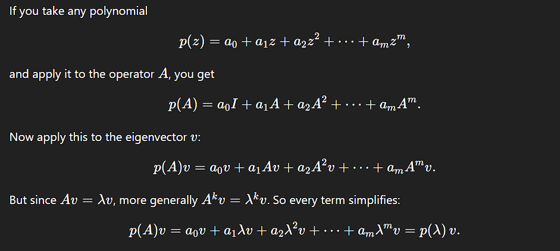

# Eigenvectors and Eigenvalues

A matrix $A$ represents a linear transformation. An **eigenvector** of a square matrix $A$ is a non-zero vector $\mathbf{v}$ that, when the matrix $A$ is multiplied by $\mathbf{v}$, the direction of $\mathbf{v}$ is unchanged.

The result is simply the original vector $\mathbf{v}$ scaled by some number $\lambda$.

This number $\lambda$ is the **eigenvalue** corresponding to the eigenvector $\mathbf{v}$.

Eigenvalues are defined only for square matrices $ A \in F\_{n \times n} $

### Mathematical Formulation

The defining equation is:

$$\boxed{A\mathbf{v} = \lambda\mathbf{v}}$$

where:

-   $A$ is an $n \times n$ square matrix
-   $\mathbf{v} \neq \mathbf{0}$ is the eigenvector
-   $\lambda$ is the eigenvalue (can be zero, negative, or complex)

### Geometric Interpretation

When a matrix transforms most vectors, it both **rotates** and **scales** them. But eigenvectors are special:

-   They only get **scaled** (stretched or shrunk)
-   Their **direction** remains the same (or flips if $\lambda < 0$)

## Simple 2×2 Example

Consider:
$$A = \begin{bmatrix} 3 & 1 \\ 0 & 2 \end{bmatrix}$$

**Eigenvector 1**: $\mathbf{v}_1 = \begin{bmatrix} 1 \\ 0 \end{bmatrix}$

Check: $A\mathbf{v}_1 = \begin{bmatrix} 3 & 1 \\ 0 & 2 \end{bmatrix} \begin{bmatrix} 1 \\ 0 \end{bmatrix} = \begin{bmatrix} 3 \\ 0 \end{bmatrix} = 3\begin{bmatrix} 1 \\ 0 \end{bmatrix}$

So $\lambda_1 = 3$ ✓

**Eigenvector 2**: $\mathbf{v}_2 = \begin{bmatrix} 1 \\ -1 \end{bmatrix}$

Check: $A\mathbf{v}_2 = \begin{bmatrix} 3 & 1 \\ 0 & 2 \end{bmatrix} \begin{bmatrix} 1 \\ -1 \end{bmatrix} = \begin{bmatrix} 2 \\ -2 \end{bmatrix} = 2\begin{bmatrix} 1 \\ -1 \end{bmatrix}$

So $\lambda_2 = 2$ ✓

## Finding Eigenvalues and Eigenvectors

### Step 1: Find Eigenvalues

Rearrange $A\mathbf{v} = \lambda\mathbf{v}$ to:
$$(A - \lambda I)\mathbf{v} = \mathbf{0}$$

For non-zero $\mathbf{v}$ to exist, the matrix $(A - \lambda I)$ must be singular:

$$\det(A - \lambda I) = 0$$

This gives the **characteristic equation**.

### Step 2: Find Eigenvectors

For each eigenvalue $\lambda_i$, solve:
$$(A - \lambda_i I)\mathbf{v} = \mathbf{0}$$

The solutions (excluding $\mathbf{v} = \mathbf{0}$) are the eigenvectors.

#### **Simplifying Computations**

-   Powers of matrices: $$\boxed{A^k\mathbf{v} = \lambda^k\mathbf{v}}$$
-   Matrix exponentials: $e^{At}\mathbf{v} = e^{\lambda t}\mathbf{v}$

#### Proof (by induction on k)

-   Base cases:
    -   $k=0$: $A^0 v = I v = v = \lambda^0 v$.
    -   $k=1$: $A^1 v = A v = \lambda v = \lambda^1 v$ (by definition).
-   Inductive step:
    Assume $A^k v = \lambda^k v$ for some $k\ge 1$. Then
    $$
    A^{k+1} v = A(A^k v) = A(\lambda^k v) = \lambda^k (A v) = \lambda^k(\lambda v) = \lambda^{k+1} v.
    $$
    Hence, by induction, $A^k v = \lambda^k v$ for all $k\in\mathbb{N}$.

If $A$ is invertible, the identity extends to all integers $k\in\mathbb{Z}$:

$$
A^{-k} v = \lambda^{-k} v,
$$

since $A^{-1}v = \lambda^{-1} v$ and the same induction applies.

#### Conceptual view

An eigenvector $v$ specifies an invariant one-dimensional subspace (an “axis”) of the transformation $A$. Acting by $A$ on that axis is simply scaling by $\lambda$. Reapplying $A$ $k$ times composes the same scaling $k$ times, yielding $\lambda^k$ overall.

When you multiply an eigenvector $\mathbf{v}$ by $A$:

1. It stays perfectly on its axis (direction unchanged)
2. It only gets scaled by factor $\lambda$

So applying $A$ exactly $k$ times means:

-   First application: Scale by $\lambda$
-   Second application: Scale by $\lambda$ again
-   Third application: Scale by $\lambda$ again
-   ...
-   $k$-th application: Scale by $\lambda$ again

Total scaling = $\lambda \times \lambda \times \cdots \times \lambda$ ($k$ times) = $\lambda^k$

-   Polynomial functional calculus: For any polynomial $p$,

    $$
    p(A)v = p(\lambda)\,v.
    $$

    

-   Analytic functions (when defined via convergent power series): If $f(z)=\sum_{k\ge 0} a_k z^k$ converges at $\lambda$, then

    $$
    f(A)v = \sum_{k\ge 0} a_k A^k v = \sum_{k\ge 0} a_k \lambda^k v = f(\lambda)\,v.
    $$

    Examples: $e^{tA}v = e^{t\lambda} v$, $(A-\mu I)^{-1}v = (\lambda-\mu)^{-1} v$ (when $\lambda\ne \mu$).

-   Instead of computing $A^{100}$ (which requires 99 matrix multiplications), if we know the eigendecomposition:
    $$A^{100}\mathbf{x} = A^{100}(c_1\mathbf{v}_1 + \cdots + c_n\mathbf{v}_n) = c_1\lambda_1^{100}\mathbf{v}_1 + \cdots + c_n\lambda_n^{100}\mathbf{v}_n$$

#### **Understanding System Behavior**

-   **Stability**: If all $|\lambda_i| < 1$, repeated applications of $A$ shrink vectors
-   **Growth**: If any $|\lambda_i| > 1$, the system exhibits growth
-   **Oscillations**: Complex eigenvalues indicate rotational behavior

#### **Applications**

-   **Principal Component Analysis (PCA)**: Eigenvectors of covariance matrices
-   **Google PageRank**: Dominant eigenvector of web link matrix
-   **Quantum Mechanics**: Energy states are eigenvalues
-   **Vibrations**: Natural frequencies are related to eigenvalues

### Special Cases

#### Symmetric Matrices

For real symmetric matrices:

-   All eigenvalues are real
-   Eigenvectors are orthogonal

#### Diagonal Matrices

Eigenvalues are the diagonal entries, eigenvectors are standard basis vectors

#### Identity Matrix

Every non-zero vector is an eigenvector with eigenvalue 1

### Key Properties

1. **Trace**: $\text{tr}(A) = \sum \lambda_i$
2. **Determinant**: $\det(A) = \prod \lambda_i$
3. **Invertibility**: $A$ is invertible iff all $\lambda_i \neq 0$
4. **Diagonalization**: If $A$ has $n$ independent eigenvectors, then $A = PDP^{-1}$ where $D$ is diagonal

---

## Sum of Algebraic Multiplicities

For any $n \times n$ matrix, the sum of the algebraic multiplicities of all its eigenvalues must equal $n$.

$$\boxed{\sum_{i=1}^{k} \text{AM}(\lambda_i) = n}$$

where $\lambda_1, \lambda_2, \ldots, \lambda_k$ are the distinct eigenvalues.

The eigenvalues of an $n \times n$ matrix $A$ are the roots of its characteristic polynomial:

$$\det(A - \lambda I) = 0$$

This polynomial will **always** have degree $n$ because:

$$
\det(A - \lambda I) = \det\begin{bmatrix}
a_{11}-\lambda & a_{12} & \cdots & a_{1n} \\
a_{21} & a_{22}-\lambda & \cdots & a_{2n} \\
\vdots & \vdots & \ddots & \vdots \\
a_{n1} & a_{n2} & \cdots & a_{nn}-\lambda
\end{bmatrix}
$$

When expanded, the highest power of $\lambda$ comes from the product of diagonal terms:
$$(a_{11}-\lambda)(a_{22}-\lambda)\cdots(a_{nn}-\lambda)$$

This gives us $(-\lambda)^n$ plus lower degree terms, so:
$$\det(A - \lambda I) = (-1)^n\lambda^n + \text{lower degree terms}$$

By the Fundamental Theorem of Algebra, a polynomial of degree $n$ has exactly $n$ roots (counting multiplicities) in $\mathbb{C}$.

Therefore, the characteristic polynomial has exactly $n$ roots, and the sum of their multiplicities must be $n$.

---

#### Example

$$
D = \begin{bmatrix}
3 & 0 & 0 & 0 \\
0 & 3 & 0 & 0 \\
0 & 0 & 1 & 0 \\
0 & 0 & 0 & 1
\end{bmatrix}
$$

Characteristic polynomial: $(\lambda - 3)^2(\lambda - 1)^2 = 0$

-   $\lambda_1 = 3$ with AM = 2
-   $\lambda_2 = 1$ with AM = 2
-   Sum of multiplicities: $2 + 2 = 4$ ✓

---

-   Real Matrices with Complex Eigenvalues
    For real matrices, complex eigenvalues come in conjugate pairs: - If $\lambda = a + bi$ is an eigenvalue, so is $\bar{\lambda} = a - bi$ - Both have the same algebraic multiplicity

---

# Eigendecomposition

Eigendecomposition is the process of breaking down a square matrix into a set of its most fundamental components: its **eigenvalues** and **eigenvectors**.

If a matrix $A$ is diagonalizable, it can be expressed in the form:

$$\boxed{A = PDP^{-1}}$$

This equation is the **eigendecomposition** of $A$.

-   **$A$**: The original $n \times n$ matrix that we are decomposing
-   **$P$**: An $n \times n$ matrix whose columns are the linearly independent **eigenvectors** of $A$
-   **$D$**: A diagonal matrix containing the **eigenvalues** of $A$. Each eigenvalue on the diagonal corresponds to the eigenvector in the same column of $P$
-   **$P^{-1}$**: The inverse of the eigenvector matrix $P$

### Visual Representation

$$A = \underbrace{\begin{bmatrix} | & | & & | \\ \mathbf{v}_1 & \mathbf{v}_2 & \cdots & \mathbf{v}_n \\ | & | & & | \end{bmatrix}}_{P} \underbrace{\begin{bmatrix} \lambda_1 & 0 & \cdots & 0 \\ 0 & \lambda_2 & \cdots & 0 \\ \vdots & \vdots & \ddots & \vdots \\ 0 & 0 & \cdots & \lambda_n \end{bmatrix}}_{D} P^{-1}$$

## The Condition: The Matrix Must Be Diagonalizable

Eigendecomposition is only possible if the matrix $A$ is **diagonalizable**. This means it must have **$n$ linearly independent eigenvectors** to form the invertible matrix $P$.

### Quick Check

For every eigenvalue, its **algebraic multiplicity** must equal its **geometric multiplicity**.

### Examples of Always Diagonalizable Matrices

-   Symmetric matrices
-   Matrices with $n$ distinct eigenvalues
-   Orthogonal matrices

## Why is Eigendecomposition Useful?

Decomposing a matrix into its eigenvalues and eigenvectors is incredibly useful because it reveals the matrix's fundamental properties and simplifies complex calculations.

### 1. It Reveals the Geometry of the Transformation

The formula $A = PDP^{-1}$ provides deep insight into what the matrix $A$ does to a vector. It says the transformation $A$ is equivalent to three simple steps:

1. **$P^{-1}$**: Change from the standard basis to the basis of eigenvectors
2. **$D$**: Perform a simple scaling along these new eigenvector axes
3. **$P$**: Change back to the standard basis

It shows that even a complex-looking transformation is just a simple stretch/shrink along its special eigenvector directions.

It transforms the matrix from its "standard coordinate" representation into its most natural form—scaling along its eigenvector directions.

### 2. It Simplifies Calculations

#### Computing Powers

Instead of multiplying $A$ by itself 100 times:
$$A^{100} = (PDP^{-1})^{100} = PD^{100}P^{-1}$$

Calculating $D^{100}$ is trivial—just raise each diagonal eigenvalue to the 100th power:
$$D^{100} = \begin{bmatrix} \lambda_1^{100} & 0 & \cdots & 0 \\ 0 & \lambda_2^{100} & \cdots & 0 \\ \vdots & \vdots & \ddots & \vdots \\ 0 & 0 & \cdots & \lambda_n^{100} \end{bmatrix}$$

#### Matrix Exponential

$$e^{At} = Pe^{Dt}P^{-1}$$
where $e^{Dt} = \text{diag}(e^{\lambda_1 t}, e^{\lambda_2 t}, \ldots, e^{\lambda_n t})$

### 3. Key Applications

Eigendecomposition is a cornerstone of many advanced fields:

| Field                 | Application                                                     |
| --------------------- | --------------------------------------------------------------- |
| **Physics**           | Solving systems of linear differential equations                |
| **Data Science**      | Principal Component Analysis (PCA) for dimensionality reduction |
| **Quantum Mechanics** | Finding the principal states of a system                        |
| **Engineering**       | Stability analysis of dynamical systems                         |
| **Computer Graphics** | Rotation and transformation calculations                        |
| **Machine Learning**  | Spectral clustering, kernel methods                             |

### Diagonalizable Matrices

A square matrix is **diagonalizable** if it is similar to a diagonal matrix. This means the matrix $A$ can be written as:

$$\boxed{A = PDP^{-1}}$$

where:

-   $D$ is a diagonal matrix of the eigenvalues
-   $P$ is an invertible matrix whose columns are the corresponding linearly independent eigenvectors

Conceptually, this means the transformation represented by $A$ becomes a simple scaling operation when viewed in a coordinate system defined by its eigenvectors.

`Diagonalizing a matrix is like finding a new coordinate system (defined by the eigenvectors) in which the transformation represented by the matrix A is much simpler as it just stretches or shrinks the space along the new coordinate axes (by the amounts of the eigenvalues).`

### The Test for Diagonalizability

The easiest way to determine if a matrix is diagonalizable is to compare the multiplicities of its eigenvalues. An $n \times n$ matrix is diagonalizable if and only if for every eigenvalue $\lambda$:

$$\boxed{\text{Algebraic Multiplicity} = \text{Geometric Multiplicity}}$$

-   **Algebraic Multiplicity (AM)**: How many times an eigenvalue is a root of the characteristic polynomial
-   **Geometric Multiplicity (GM)**: The dimension of the eigenspace for that eigenvalue (i.e., the number of linearly independent eigenvectors)

If even one eigenvalue fails this test (GM < AM), the matrix is not diagonalizable.

## The Diagonalization Process

Given a diagonalizable matrix $A$:

1. **Find all eigenvalues** by solving $\det(A - \lambda I) = 0$
2. **Find eigenvectors** for each eigenvalue by solving $(A - \lambda_i I)\mathbf{v} = \mathbf{0}$
3. **Form matrix $P$** with eigenvectors as columns, by stacking $n$ independent eigenvectors as columns.
4. **Form diagonal matrix $D$** with corresponding eigenvalues. The $i$-th diagonal entry matches the eigenvalue of the $i$-th column of $P$.
5. **Verify**: $A = PDP^{-1}$

### Examples

#### Diagonalizable Matrix

$$A = \begin{bmatrix} 4 & 1 \\ 2 & 3 \end{bmatrix}$$

Eigenvalues: $\lambda_1 = 5$, $\lambda_2 = 2$

-   $\lambda_1 = 5$: AM = 1, GM = 1 ✓
-   $\lambda_2 = 2$: AM = 1, GM = 1 ✓

**Conclusion**: Diagonalizable!

$$P = \begin{bmatrix} 1 & -1 \\ 1 & 2 \end{bmatrix}, \quad D = \begin{bmatrix} 5 & 0 \\ 0 & 2 \end{bmatrix}$$

#### Non-Diagonalizable Matrix

$$B = \begin{bmatrix} 3 & 1 \\ 0 & 3 \end{bmatrix}$$

Eigenvalue: $\lambda = 3$ (with AM = 2)

Find eigenspace
$$(B - 3I)\mathbf{v} = \begin{bmatrix} 0 & 1 \\ 0 & 0 \end{bmatrix}\mathbf{v} = \mathbf{0}$$

Eigenspace: $\text{span}\left\{\begin{bmatrix} 1 \\ 0 \end{bmatrix}\right\}$, so GM = 1

**Conclusion**: GM (1) < AM (2), so **not diagonalizable**!

-   If an $n \times n$ matrix has $n$ distinct eigenvalues, it's automatically diagonalizable.

-   The Spectral Theorem : Real symmetric matrices are always diagonalizable (by orthogonal matrices).

    A real symmetric matrix will always have real eigenvalues. This is not true for non-symmetric matrices, which can have complex eigenvalues

          What is an Orthogonal Matrix?

          An orthogonal matrix Q is a special kind of square matrix with the following properties:

          All of its columns (and rows) are orthonormal. This means each column vector has a length of 1, and each column vector is perpendicular (orthogonal) to all other column vectors.

    The inverse of an orthogonal matrix is its transpose: $ Q^{-1} = Q^T $

    Orthogonal matrices represent transformations that preserve lengths and angles, such as rotations and reflections

    The eigenvectors corresponding to distinct eigenvalues of real symmetric matrix are always orthogonal to each other.

    The transformation represented by a real symmetric matrix can be understood as a simple scaling (stretching or shrinking) along a set of perpendicular axes. The orthogonal matrix Q represents the rotation needed to align the standard coordinate axes with these new, perpendicular axes (the eigenvectors).

    $$A = QDQ^T$$

-   An $n \times n$ matrix is diagonalizable if and only if it has $n$ linearly independent _eigenvectors_.

### Example : Diagonalizing Matrix C

### Matrix C

$$
C = \begin{bmatrix}
1 & 0 & 0 & 1 \\
1 & 1 & 0 & 1 \\
1 & 0 & 1 & 1 \\
1 & 0 & 0 & 1
\end{bmatrix}
$$

## 1. Determine if it's Diagonalizable

### Finding Eigenvalues

Solve $\det(C - \lambda I) = 0$:

$$
\det\begin{bmatrix}
1-\lambda & 0 & 0 & 1 \\
1 & 1-\lambda & 0 & 1 \\
1 & 0 & 1-\lambda & 1 \\
1 & 0 & 0 & 1-\lambda
\end{bmatrix} = 0
$$

Expanding along the first row:

$= (1-\lambda) \cdot \det\begin{bmatrix} 1-\lambda & 0 & 1 \\ 0 & 1-\lambda & 1 \\ 0 & 0 & 1-\lambda \end{bmatrix} - 1 \cdot \det\begin{bmatrix} 1 & 1-\lambda & 0 \\ 1 & 0 & 1-\lambda \\ 1 & 0 & 0 \end{bmatrix}$

-   First determinant (triangular): $(1-\lambda)^3$
-   Second determinant: $(1-\lambda)^2$

Characteristic equation:
$$(1-\lambda)(1-\lambda)^3 - (1-\lambda)^2 = 0$$
$$(1-\lambda)^4 - (1-\lambda)^2 = 0$$
$$(1-\lambda)^2[(1-\lambda)^2 - 1] = 0$$

This gives:

-   $(1-\lambda)^2 = 0 \Rightarrow \lambda = 1$ (multiplicity 2)
-   $(1-\lambda)^2 = 1 \Rightarrow \lambda = 0$ or $\lambda = 2$

**Eigenvalues**: $\lambda_1 = 0$, $\lambda_2 = 2$, $\lambda_3 = 1$, $\lambda_4 = 1$

### Checking Geometric Multiplicity for λ = 1

$$
C - I = \begin{bmatrix}
0 & 0 & 0 & 1 \\
1 & 0 & 0 & 1 \\
1 & 0 & 0 & 1 \\
1 & 0 & 0 & 0
\end{bmatrix} \xrightarrow{\text{REF}} \begin{bmatrix}
1 & 0 & 0 & 0 \\
0 & 0 & 0 & 1 \\
0 & 0 & 0 & 0 \\
0 & 0 & 0 & 0
\end{bmatrix}
$$

-   Rank = 2 (two pivots)
-   Geometric multiplicity = $n - \text{rank}(C-I) = 4 - 2 = 2$
-   Algebraic multiplicity = 2

Since AM = GM for all eigenvalues, **C is diagonalizable**.

### Example : Diagonalize Matrix C

#### Finding Eigenvectors

**For λ = 0** (Null space of C):

-   From $C\mathbf{x} = \mathbf{0}$: $x_1 = 0$, $x_4 = 0$, $x_2 + x_3 = 0$
-   Let $x_3 = t$, then $x_2 = -t$
-   Eigenvector: $\mathbf{v}_1 = \begin{bmatrix} 0 \\ -1 \\ 1 \\ 0 \end{bmatrix}$

**For λ = 2** (Null space of C - 2I):

$$
C - 2I = \begin{bmatrix}
-1 & 0 & 0 & 1 \\
1 & -1 & 0 & 1 \\
1 & 0 & -1 & 1 \\
1 & 0 & 0 & -1
\end{bmatrix} \rightarrow \begin{bmatrix}
1 & 0 & 0 & -1 \\
0 & 1 & 0 & -2 \\
0 & 0 & 1 & -2 \\
0 & 0 & 0 & 0
\end{bmatrix}
$$

-   Solution: $x_1 = x_4$, $x_2 = 2x_4$, $x_3 = 2x_4$
-   Eigenvector: $\mathbf{v}_2 = \begin{bmatrix} 1 \\ 2 \\ 2 \\ 1 \end{bmatrix}$

**For λ = 1** (Null space of C - I):

-   From earlier: $x_1 = 0$, $x_4 = 0$, $x_2$ and $x_3$ are free
-   Two eigenvectors: $\mathbf{v}_3 = \begin{bmatrix} 0 \\ 1 \\ 0 \\ 0 \end{bmatrix}$, $\mathbf{v}_4 = \begin{bmatrix} 0 \\ 0 \\ 1 \\ 0 \end{bmatrix}$

#### Constructing P and D

$$
P = \begin{bmatrix}
0 & 1 & 0 & 0 \\
-1 & 2 & 1 & 0 \\
1 & 2 & 0 & 1 \\
0 & 1 & 0 & 0
\end{bmatrix}, \quad D = \begin{bmatrix}
0 & 0 & 0 & 0 \\
0 & 2 & 0 & 0 \\
0 & 0 & 1 & 0 \\
0 & 0 & 0 & 1
\end{bmatrix}
$$

#### Constructing D

#### Key Principle

The diagonal matrix $D$ is formed by placing eigenvalues along the main diagonal. **The order must correspond to the order of eigenvectors in $P$**.

#### Why Order Matters

The diagonalization equation $AP = PD$ expands to:

$$
A[\mathbf{v}_1 | \mathbf{v}_2 | \mathbf{v}_3 | \mathbf{v}_4] = [\mathbf{v}_1 | \mathbf{v}_2 | \mathbf{v}_3 | \mathbf{v}_4]\begin{bmatrix}
\lambda_1 & 0 & 0 & 0 \\
0 & \lambda_2 & 0 & 0 \\
0 & 0 & \lambda_3 & 0 \\
0 & 0 & 0 & \lambda_4
\end{bmatrix}
$$

This is equivalent to the system:

-   $A\mathbf{v}_1 = \lambda_1\mathbf{v}_1$
-   $A\mathbf{v}_2 = \lambda_2\mathbf{v}_2$
-   $A\mathbf{v}_3 = \lambda_3\mathbf{v}_3$
-   $A\mathbf{v}_4 = \lambda_4\mathbf{v}_4$

### Special Cases

#### Real Schur Decomposition

For non-diagonalizable matrices, we can still decompose:
$$A = QTQ^T$$
where $Q$ is orthogonal and $T$ is upper triangular.

---

### Why $A^k = PD^k P^{-1}$

If we want to compute $A^2$, we just multiply $A$ by itself:

$$A^2 = A \cdot A$$

Now, substitute the diagonalized form for each $A$:

$$A^2 = (PDP^{-1}) \cdot (PDP^{-1})$$

Matrix multiplication is associative, which means we can regroup the parentheses however we like. Let's regroup them in the middle:

$$A^2 = P \cdot D \cdot \underbrace{(P^{-1} \cdot P)}_{\text{This is } I} \cdot D \cdot P^{-1}$$

Here comes the magic. A matrix multiplied by its inverse $(P^{-1}P)$ is the identity matrix $I$:

$$A^2 = P \cdot D \cdot I \cdot D \cdot P^{-1}$$

And multiplying any matrix by the identity matrix leaves it unchanged $(D \cdot I = D)$:

$$A^2 = P \cdot D \cdot D \cdot P^{-1}$$

Finally, $D \cdot D$ is just $D^2$:

$$\boxed{A^2 = PD^2P^{-1}}$$

The pattern continues. Let's look at $A^3$:

$$A^3 = A^2 \cdot A = (PD^2P^{-1}) \cdot (PDP^{-1})$$

Regroup in the middle:

$$A^3 = P \cdot D^2 \cdot \underbrace{(P^{-1} \cdot P)}_{= I} \cdot D \cdot P^{-1}$$

The $P^{-1}P$ in the middle becomes the identity matrix and vanishes:

$$A^3 = P \cdot D^2 \cdot D \cdot P^{-1} = P \cdot D^3 \cdot P^{-1}$$

$$\boxed{A^3 = PD^3P^{-1}}$$

For $A^{100}$

When you write out $A^{100}$, you are writing out $(PDP^{-1})$ one hundred times:

$$A^{100} = \underbrace{(PDP^{-1})(PDP^{-1})(PDP^{-1}) \cdots (PDP^{-1})}_{\text{100 times}}$$

When we regroup, every $P^{-1}$ on the right of a term will be next to a $P$ on the left of the next term. All these "inner" pairs will cancel out into identity matrices:

$$A^{100} = P \cdot D \cdot \underbrace{(P^{-1}P)}_{=I} \cdot D \cdot \underbrace{(P^{-1}P)}_{=I} \cdot D \cdots \underbrace{(P^{-1}P)}_{=I} \cdot D \cdot P^{-1}$$

All the $(P^{-1}P)$ pairs become $I$, and multiplying by $I$ does nothing. You are left with:

-   The $P$ from the very beginning
-   The $P^{-1}$ from the very end
-   One hundred $D$'s multiplied together in the middle

$$A^{100} = P \cdot \underbrace{(D \cdot D \cdot D \cdots D)}_{\text{100 } D\text{'s}} \cdot P^{-1}$$

Therefore:

$$\boxed{A^{100} = PD^{100}P^{-1}}$$

---
## The Trace of a Matrix

The **trace of a square matrix** is the sum of the elements on its **main diagonal** (top-left to bottom-right).

## Definition

For an $n \times n$ matrix

$$
A = \begin{bmatrix}
a_{11} & a_{12} & \cdots & a_{1n} \\
a_{21} & a_{22} & \cdots & a_{2n} \\
\vdots & \vdots & \ddots & \vdots \\
a_{n1} & a_{n2} & \cdots & a_{nn}
\end{bmatrix}
$$

the **trace** is

$$\boxed{\text{tr}(A) = a_{11} + a_{22} + \cdots + a_{nn} = \sum_{i=1}^n a_{ii}}$$

## Example

$$
A = \begin{bmatrix}
2 & 3 & 1 \\
0 & -1 & 4 \\
5 & 2 & 7
\end{bmatrix}
$$

$$\text{tr}(A) = 2 + (-1) + 7 = 8$$

### Properties
- **Linearity**: $\text{tr}(A + B) = \text{tr}(A) + \text{tr}(B)$
- **Scalar multiplication**: $\text{tr}(cA) = c \cdot \text{tr}(A)$ for any scalar $c$
- **Cyclic property**: $\text{tr}(AB) = \text{tr}(BA)$ (crucial for many proofs!)
- **Eigenvalue sum**: $\text{tr}(A) = \sum_{i=1}^n \lambda_i$ (sum of all eigenvalues)
- $\text{tr}(ABC) = \text{tr}(BCA) = \text{tr}(CAB)$ (cyclic permutation)

The trace of a matrix is an **invariant** property—it doesn't change even when the coordinate system is rotated or changed. This is because:

$$\text{tr}(P^{-1}AP) = \text{tr}(APP^{-1}) = \text{tr}(A)$$

This makes trace particularly useful for describing fundamental properties of systems.

### Applications

#### Data Science and Statistics: Measuring Total Variance

In data analysis, the **covariance matrix** describes how variables spread out and relate to each other.

**Key fact**: The trace of the covariance matrix equals the **total variance** of the dataset.

$$\text{Total Variance} = \text{tr}(\Sigma) = \sum_{i=1}^n \text{Var}(X_i)$$

This is fundamental in:
- **Principal Component Analysis (PCA)**: Finding axes that capture maximum variance
- **Dimensionality reduction**: Preserving as much total variance as possible

#### Machine Learning

- **Nuclear norm**: $||A||_* = \text{tr}(\sqrt{A^T A})$ (used in matrix completion)
- **Frobenius norm**: $||A||_F^2 = \text{tr}(A^T A)$
- **Regularization**: Trace penalties encourage certain matrix structures

---

