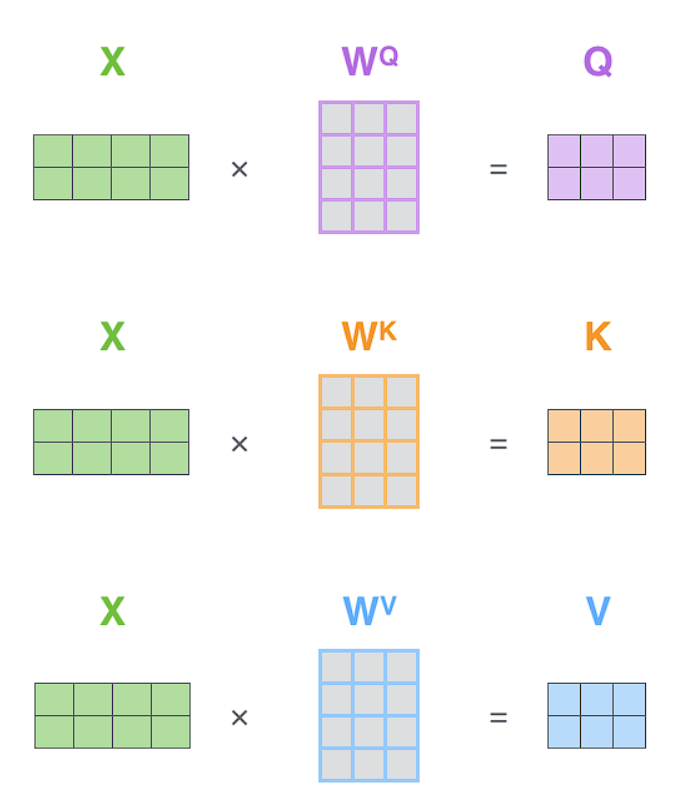
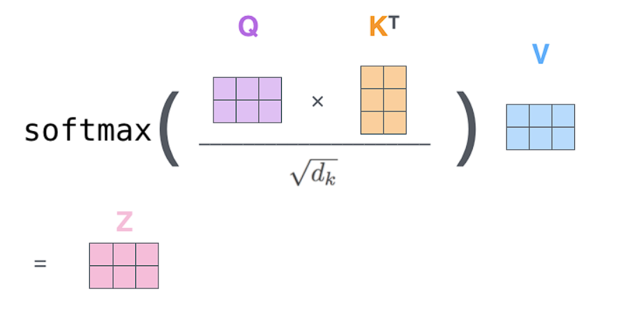

# Attention Is All You Need

> **Paper:** [Attention Is All You Need](https://arxiv.org/abs/1706.03762)  
> **Authors:** Vaswani et al. (Google Brain, 2017)

---

## Overview

The paper introduces the **Transformer** architecture — a model based entirely on attention mechanisms, dispensing with recurrence and convolutions.

---
![[Pasted image 20260201004557.png]]ENCODER

An encoder receives a list of vectors as input. It processes this list by passing these vectors into a ‘self-attention’ layer, then into a feed-forward neural network, then sends out the output upwards to the next encoder.

**Self attention** 
As the model processes each word (each position in the input sequence), self attention allows it to look at other positions in the input sequence for clues that can help lead to a better encoding for this word.

**Calculate self-attention using vectors**

***Step 1*** : For each word, we create a Query vector, a Key vector, and a Value vector. These vectors are created by multiplying the embedding by three matrices (Wq, Wk, Wv) that we trained during the training process.

> **Note:** Wq, Wk, Wv are **learned parameters** — they start randomly initialized and are optimized during training. When using pretrained models like BERT or GPT, these matrices come pre-trained.

![[Pasted image 20260202231651.png]]
These new vectors are smaller in dimension than the embedding vector. Their dimensionality is 64, while the embedding and encoder input/output vectors have dimensionality of 512.

***Step 2*** : To calculate a score. The score determines how much focus to place on other parts of the input sentence as we encode a word at a certain position. 
The score is calculated by taking the dot product of the query vector with the key vector of the respective word we’re scoring. So if we’re processing the self-attention for the word in position #1, the first score would be the dot product of q1 and k1. The second score would be the dot product of q1 and k2.

***Step 3*** : Divide the scores by the square root of the dimension of the key vectors used (√dₖ). This leads to having more stable gradients.

> **Why √dₖ?** For large dₖ, dot products can grow very large in magnitude, pushing the softmax function into regions where it has extremely small gradients (saturated). This makes training difficult. Scaling by √dₖ keeps the values in a reasonable range.

***Step 4*** : Pass the result from Step 3 through a softmax operation. Softmax normalizes the scores so they’re all positive and add up to 1.

***Step 5*** : Multiply each value vector by the softmax score. The intuition here is to keep intact the values of the word(s) we want to focus on, and drown-out irrelevant words (by multiplying them by tiny numbers like 0.001).

***Step 6*** :  Sum up the weighted value vectors. This produces the output of the self-attention layer at this position

![[Pasted image 20260202232937.png]]

> **Matrix Form:** The steps above show single-word calculation for clarity. In practice, we compute attention for **all words simultaneously** using matrix multiplication — the Q, K, V matrices contain all query/key/value vectors stacked together, making it highly parallelizable on GPUs.

The entire self-attention calculation can be summarized by this equation:

$$\text{Attention}(Q, K, V) = \text{softmax}\left(\frac{QK^T}{\sqrt{d_k}}\right)V$$

``
The matrix multiplication by V performs the weighted sum
``

<div style="display: flex; gap: 20px; align-items: center; justify-content: center;">
  
  
</div>

**Let:**

$$Q \in \mathbb{R}^{n_q \times d_k}$$

$$K \in \mathbb{R}^{n_k \times d_k}$$

$$V \in \mathbb{R}^{n_k \times d_v}$$

**Score matrix:**

$$S = \frac{QK^T}{\sqrt{d_k}} \in \mathbb{R}^{n_q \times n_k}$$

**Attention weights (the "attention matrix"):**

$$A = \text{softmax}(S)$$

Softmax is applied row-wise (over the $n_k$ keys for each query), so each row sums to 1:

$$A \in \mathbb{R}^{n_q \times n_k}$$

**Final attention output:**

$$O = AV \in \mathbb{R}^{n_q \times d_v}$$

**Simple Example: Self-Attention for "Hello World" (Pure Python)**

```python
import math

# Step 0: Simple embeddings for "Hello" and "World" (2 words, 4 dimensions each)
X = [
    [1.0, 0.0, 1.0, 0.0],  # "Hello" embedding
    [0.0, 1.0, 0.0, 1.0],  # "World" embedding
]

# Weight matrices Wq, Wk, Wv (4x3 - projecting from 4 dims to 3 dims)
Wq = [[0.1, 0.2, 0.3], [0.4, 0.5, 0.6], [0.7, 0.8, 0.9], [0.1, 0.2, 0.3]]
Wk = [[0.2, 0.3, 0.4], [0.5, 0.6, 0.7], [0.8, 0.9, 0.1], [0.2, 0.3, 0.4]]
Wv = [[0.3, 0.4, 0.5], [0.6, 0.7, 0.8], [0.9, 0.1, 0.2], [0.3, 0.4, 0.5]]

# Helper: Matrix multiply
def matmul(A, B):
    return [[sum(a * b for a, b in zip(row, col)) for col in zip(*B)] for row in A]

# Helper: Transpose
def transpose(M):
    return [list(row) for row in zip(*M)]

# Helper: Softmax (row-wise)
def softmax(row):
    exp_row = [math.exp(x) for x in row]
    total = sum(exp_row)
    return [x / total for x in exp_row]

# Step 1: Compute Q, K, V
Q = matmul(X, Wq)  # [2x4] @ [4x3] = [2x3]
K = matmul(X, Wk)
V = matmul(X, Wv)

print("Q (Queries):", Q)
print("K (Keys):", K)
print("V (Values):", V)

# Step 2: Compute scores = Q @ K^T
K_T = transpose(K)
scores = matmul(Q, K_T)  # [2x3] @ [3x2] = [2x2]
print("\nScores (Q @ K^T):", scores)

# Step 3: Scale by sqrt(d_k)
d_k = len(K[0])  # dimension of keys = 3
scaled_scores = [[s / math.sqrt(d_k) for s in row] for row in scores]
print("Scaled scores:", scaled_scores)

# Step 4: Apply softmax (row-wise)
attention_weights = [softmax(row) for row in scaled_scores]
print("Attention weights:", attention_weights)

# Step 5 & 6: Multiply by V to get output
output = matmul(attention_weights, V)  # [2x2] @ [2x3] = [2x3]
print("\nFinal output Z:", output)

# Output shows: each word now has context from both words!
# Z[0] = weighted combination of V[0] and V[1] for "Hello"
# Z[1] = weighted combination of V[0] and V[1] for "World"
```

**Output:**
```
Q (Queries): [[0.8, 1.0, 1.2], [0.5, 0.7, 0.9]]
K (Keys): [[1.0, 1.2, 0.5], [0.7, 0.9, 1.1]]
V (Values): [[1.2, 0.5, 0.7], [0.9, 1.1, 1.3]]

Scores (Q @ K^T): [[1.4, 1.58], [1.04, 1.18]]
Scaled scores: [[0.808, 0.912], [0.600, 0.681]]
Attention weights: [[0.474, 0.526], [0.480, 0.520]]

Final output Z: [[1.042, 0.785, 0.985], [1.044, 0.788, 0.988]]
```

> Notice how both "Hello" and "World" attend to each other with ~50/50 weights, creating output vectors that blend information from both words!


```python
import torch
import torch.nn as nn
import math
class SelfAttention(nn.Module):
    def __init__(self, embed_size, heads):
        super().__init__()
        self.embed_size = embed_size
        self.heads = heads
        self.head_dim = embed_size // heads
        
        self.queries = nn.Linear(embed_size, embed_size)
        self.keys = nn.Linear(embed_size, embed_size)
        self.values = nn.Linear(embed_size, embed_size)
        self.fc_out = nn.Linear(embed_size, embed_size)
    
    def forward(self, x):
        N, seq_len, _ = x.shape
        
        # Linear projections
        Q = self.queries(x)
        K = self.keys(x)
        V = self.values(x)
        
        # Split into multiple heads
        Q = Q.view(N, seq_len, self.heads, self.head_dim)
        K = K.view(N, seq_len, self.heads, self.head_dim)
        V = V.view(N, seq_len, self.heads, self.head_dim)
        
        # Scaled dot-product attention
        scores = torch.einsum("nqhd,nkhd->nhqk", Q, K) / math.sqrt(self.head_dim)
        attention = torch.softmax(scores, dim=-1)
        out = torch.einsum("nhqk,nkhd->nqhd", attention, V)
        
        # Concat heads and project
        out = out.reshape(N, seq_len, self.embed_size)
        return self.fc_out(out)
class TransformerEncoder(nn.Module):
    def __init__(self, embed_size, heads, ff_hidden, dropout=0.1):
        super().__init__()
        self.attention = SelfAttention(embed_size, heads)
        self.norm1 = nn.LayerNorm(embed_size)
        self.norm2 = nn.LayerNorm(embed_size)
        
        self.feed_forward = nn.Sequential(
            nn.Linear(embed_size, ff_hidden),
            nn.ReLU(),
            nn.Linear(ff_hidden, embed_size)
        )
        self.dropout = nn.Dropout(dropout)
    
    def forward(self, x):
        # Self-attention + residual connection
        attention = self.attention(x)
        x = self.norm1(x + self.dropout(attention))
        
        # Feed-forward + residual connection
        forward = self.feed_forward(x)
        x = self.norm2(x + self.dropout(forward))
        return x
        
# Example usage
encoder = TransformerEncoder(embed_size=512, heads=8, ff_hidden=2048)
x = torch.randn(1, 10, 512)  # batch=1, seq_len=10, embed=512
output = encoder(x)
print(output.shape)  # torch.Size([1, 10, 512])
```

## Key Concepts

### 1. Self-Attention

*Add your notes here...*

### 2. Multi-Head Attention

*Add your notes here...*

### 3. Positional Encoding

*Add your notes here...*

### 4. Encoder-Decoder Architecture

*Add your notes here...*

---

## Architecture Diagram

```
Input → Embedding + Positional Encoding → Encoder (×6) → Decoder (×6) → Output
```

---

## Key Equations

### Scaled Dot-Product Attention

$$
\text{Attention}(Q, K, V) = \text{softmax}\left(\frac{QK^T}{\sqrt{d_k}}\right)V
$$

### Multi-Head Attention

$$
\text{MultiHead}(Q, K, V) = \text{Concat}(\text{head}_1, ..., \text{head}_h)W^O
$$

---

## My Notes

*Start adding your notes and insights here as you read through the paper...*

---

## Questions

- [ ] *Questions you have while reading*

---

## Key Takeaways

1. *Your main learnings will go here*

---

## References

- Original Paper: https://arxiv.org/abs/1706.03762
- The Illustrated Transformer: https://jalammar.github.io/illustrated-transformer/
